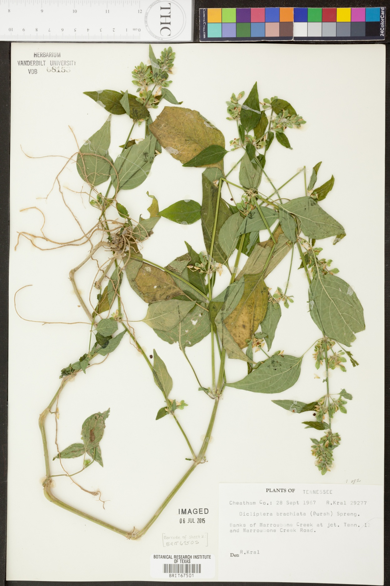
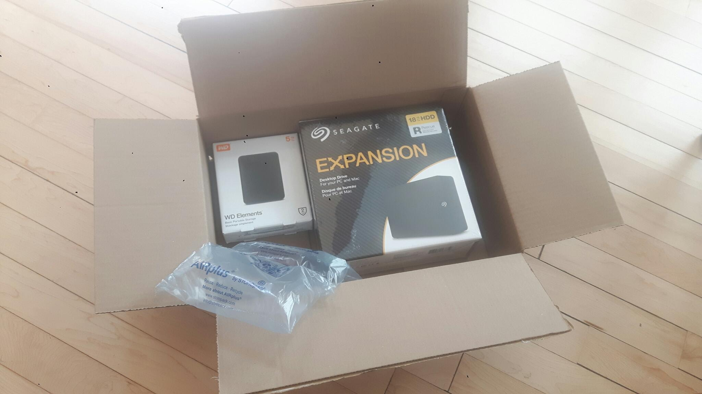

[```methods```](#methods) / [```results```](#results) / [```conclusion```](#conclusion) / [```discussion```](#discussion) 

This experimental biodiversity datasets describes Botanical Research Institute Texas (BRIT) records and associated images: 

Botanical Research Institute Texas (BRIT): Origins of BRIT collection records and associated images tracked in period 2022-06/2022-07. hash://sha256/76d40abccfc71bc2cdaf4ea4a6003b9ac49123b27abe9f0d81e233299baf5e94 https://github.com/bio-guoda/preston-brit-2022 https://linker.bio/hash://sha256/76d40abccfc71bc2cdaf4ea4a6003b9ac49123b27abe9f0d81e233299baf5e94

[](https://zxing.org/w/decode?u=https%3A%2F%2Fgithub.com%2Fbio-guoda%2Fpreston-brit-2022%2Fraw%2Fmain%2Flabel.png)

Related datasets include, obtained via ```preston ls | preston cite```:

SERNEC - 5d18ed85-2217-4a65-b415-d210725df572. Accessed at <zip:hash://sha256/371984ca4566b7b6bc760d0766873b469e12af2d87ce9218f1da888a1b4c3948!/eml.xml> .
SERNEC - e77c6bda-21ea-41a4-ace2-fb08bc160e03. Accessed at <zip:hash://sha256/c208c09101b39d534e2a9700d8abf43357f1c7707a6b5590aa528fe78d56cfbe!/eml.xml> .
TORCH Portal - af5fc908-bfa8-49a6-b37a-07849fe523a8. Accessed at <zip:hash://sha256/28ebbca9c3e3d092e6193f5f54f476815f4e347ff79b1bb7de07090e78a648ea!/eml.xml> .

# Methods 

[Preston](https://github.com/bio-guoda/preston) v0.3.9 was used to index 825,877 image urls published across three BRIT related to DwC-A records using:

```bash
# lists image urls after tracking dwca archives
preston track https://sernecportal.org/portal/content/dwca/VDB_DwC-A.zip\
 https://sernecportal.org/portal/content/dwca/NLU_DwC-A.zip\
 https://portal.torcherbaria.org/portal/content/dwca/BRIT_DwC-A.zip\
 | preston dwc-stream\
 | grep URI\
 | jq --raw-output '.["http://rs.tdwg.org/ac/terms/accessURI" | "http://rs.tdwg.org/ac/terms/thumbnailAccessURI" | "http://rs.tdwg.org/ac/terms/goodQualityAccessURI"]'\
 | gzip\
 > image-urls.tsv.gz
 # list image urls and track them
 cat image-urls.tsv.gz | gunzip | xargs -L25 preston track
 ```

The tracked image urls were retrieved using a server in a data center in Germany on a ~ 1Gb connection .

```
preston history | head -n1 | preston cat | grep -o -P "2022-[0-9]{2}-[0-9]{2}T.*Z" | sort | uniq | head -n1
2022-06-06T17:02:10.924Z
```

and ended at:

```
$ preston history --data-dir $PWD | tail -n1 | preston cat --data-dir $PWD | grep -o -P "2022-[0-9]{2}-[0-9]{2}T.*Z" | sort | uniq | head -n1
2022-07-26T16:47:05.428Z
```

so took about 1 month and 20 days at about 0.2 images/s or 1 image per 5 seconds.

# Results

## Example Image

An example of a tracked image shown below was extraced using:

```
$ preston ls -l tsv\
 | grep hasVersion\
 | grep -v "well-known"\
 | grep -v "zip"\
 | head -n1
https://bisque.cyverse.org/image_service/image/00-Bu6svkTKkNx5hdB8niSokV/resize:1250/format:jpeg	http://purl.org/pav/hasVersion	hash://sha256/a3e5efdcd9905154afea689e7e3c2756521d51265378118a66027c77eba35e06	urn:uuid:063c8cb0-b0b7-469e-a9b8-65e99803ad54
$ preston cat --remote https://linker.bio hash://sha256/a3e5efdcd9905154afea689e7e3c2756521d51265378118a66027c77eba35e06 > BRIT67501.jpg
```



with caption generated using:

```
$ preston ls\
 | grep hasVersion\
 | grep zip\
 | preston dwc-stream\
 | grep "https://bisque.cyverse.org/image_service/image/00-Bu6svkTKkNx5hdB8niSokV/resize:1250/format:jpeg"\
 | jq .
```

```json 
{
  "http://www.w3.org/ns/prov#wasDerivedFrom": "line:zip:hash://sha256/371984ca4566b7b6bc760d0766873b469e12af2d87ce9218f1da888a1b4c3948!/multimedia.csv!/L2",
  "http://www.w3.org/1999/02/22-rdf-syntax-ns#type": "http://rs.tdwg.org/ac/terms/Multimedia",
  "http://rs.tdwg.org/dwc/text/coreid": "6816308",
  "http://ns.adobe.com/xap/1.0/rights/Owner": "Vanderbilt University Herbarium (VDB)",
  "http://ns.adobe.com/xap/1.0/MetadataDate": "2018-02-02 11:58:22",
  "http://ns.adobe.com/xap/1.0/rights/WebStatement": "http://creativecommons.org/licenses/by-nc/3.0/",
  "http://purl.org/dc/terms/type": "StillImage",
  "http://rs.tdwg.org/ac/terms/associatedSpecimenReference": "https://sernecportal.org/portal/collections/individual/index.php?occid=6816308",
  "http://rs.tdwg.org/ac/terms/subtype": "Photograph",
  "http://rs.tdwg.org/ac/terms/caption": null,
  "http://rs.tdwg.org/ac/terms/thumbnailAccessURI": "https://bisque.cyverse.org/image_service/image/00-Bu6svkTKkNx5hdB8niSokV/thumbnail:200,200",
  "http://purl.org/dc/terms/format": "image/jpeg",
  "http://rs.tdwg.org/ac/terms/comments": null,
  "http://rs.tdwg.org/ac/terms/providerManagedID": "urn:uuid:36fd1d6c-3a2b-4cc0-b640-e93c2b400a01",
  "http://rs.tdwg.org/ac/terms/accessURI": "https://bisque.cyverse.org/image_service/image/00-Bu6svkTKkNx5hdB8niSokV/resize:4000/format:jpeg",
  "http://rs.tdwg.org/ac/terms/goodQualityAccessURI": "https://bisque.cyverse.org/image_service/image/00-Bu6svkTKkNx5hdB8niSokV/resize:1250/format:jpeg",
  "http://purl.org/dc/elements/1.1/creator": null,
  "http://ns.adobe.com/xap/1.0/rights/UsageTerms": "CC BY-NC (Attribution-Non-Commercial)",
  "http://rs.tdwg.org/ac/terms/metadataLanguage": "en",
  "http://purl.org/dc/terms/identifier": "https://bisque.cyverse.org/image_service/image/00-Bu6svkTKkNx5hdB8niSokV/resize:4000/format:jpeg",
  "http://purl.org/dc/terms/rights": null
}
```

More concisely, this sampled BRIT image corpus can be reference using a citation signature hash://sha256/18b51a180c63929d5e3a50dbb72295579c2645546d22ae3fdcd5e2095c43d199 . 

## Image Origins

For this corpus, the following servers were queried for reported image urls:

```
$ preston ls --data-dir $PWD  -l tsv  | grep hasVersion | sed 's+https://++g' | cut -f1 | sed 's+/.*++g' | sort | uniq -c | sort -nr
 596759 bisque.cyverse.org
 220278 web.corral.tacc.utexas.edu
   7537 api.idigbio.org
    942 portal.torcherbaria.org
    410 storage.idigbio.org
    252 sernecportal.org
     30 static.inaturalist.org
     10 urn:null
      4 inaturalist-open-data.s3.amazonaws.com
```


## Images Not Found

Preston reports non-responsive URLs as skolemized blanks see https://www.w3.org/TR/rdf11-concepts/#section-skolemization .

Using this labeling of non-responsible image URLs, the following servers produced non-responsive urls:

```
$ preston ls -l tsv\
 | grep hasVersion\
 | grep ".well-known/genid"\
 | sed 's+https://++g'\
 | cut -f1\
 | sed 's+/.*++g'\
 | sort\
 | uniq -c\
 | sort -nr
     98 web.corral.tacc.utexas.edu
     55 bisque.cyverse.org
     10 urn:null
      3 portal.torcherbaria.org
```

156 image locations appeared to yield no content on tracking them a first time. (see [#Appendix-A] and https://github.com/bio-guoda/preston-brit-2022/issues/1) 


On retrying the inaccessible content locations, only 33 remained inaccessible (see [#Appendix-B]), hinting to intermittent and permanent access issues.

## Data Transfer from Germany to US

The BRIT images were originally tracked from Germany on a commercial "off-the-shelve" server. To facilitate access, and increase redudancy, rsync was used to transfer the image corpus from Germany to the Minnesota. 

After receiving storage hardware by mail on 4 Sept 2022, the BRIT image corpus hash://sha256/76d40abccfc71bc2cdaf4ea4a6003b9ac49123b27abe9f0d81e233299baf5e94 was received in Minnesota, US from Germany on 5 Sept 2022. The corpus spanned over 900k files / 309GB and was transferred in about 21h (see below for details) via a consumer grade fiber internet connection. 



The total number of files in the received ```data``` directory was:

```
$ find . -type f | wc -l
902626
```

Also, the Rsync logs below captured the transfer statistics. 
```
[...]

data/ff/ff/ffffe29becf0e65f3c32f9bb53f18f418fc0e6ff432ab1b2176bad560930be99
        358,999 100%    2.18MB/s    0:00:00 (xfr#902621, to-chk=2/968416)
data/ff/ff/ffffe5eedcebb869f14ecf6cce5b5fcea629ae363ce833431bba46a19f8eb6c8
             78 100%    0.49kB/s    0:00:00 (xfr#902622, to-chk=1/968416)
data/ff/ff/ffffff8aa693c59e91b94e4de61d7ce035c69c94077ccf158e3d23a0a039216f
        383,141 100%    2.12MB/s    0:00:00 (xfr#902623, to-chk=0/968416)

sent 17,752,067 bytes  received 329,479,912,584 bytes  4,412,629.51 bytes/sec
total size is 329,293,755,413  speedup is 1.00
```

Finally, the ```time``` program recorded and logged the duration of the transfer. 

```
real    1244m30.854s
user    98m36.885s
sys    55m19.359s
```

## Local Verification and Duplication

After completing the transatlantic transfer onto a USB 3.0 Seagate Expansion HDD 18TB STKP180000402 PN 3EGAPR-570 connected using a Lenovo T430 running Ubuntu Ubuntu 20.04.5 LTS using Intel® Core™ i5-3320M CPU @ 2.60GHz × 4 and 8GB of memory, the content was duplicated locally to a WD Elements 5TB PN WDBU6Y0050BBK-XD.  The rsync local replication took a little over an hour (~81 minutes), and the preston-based verification took under 7 hours (322 minutes). The verification checks the local copy and verifies whether the reference content is actually present and has the expected content. Content verification is a computationally heavy operation because hundreds of thousands of files are processed and their cryptographic hashes are re-computed. The verification reported no missing or altered content. 


## Transfer by USPS

To demonstrate that the image corpus can be transferred without using the internet, the Seagate Expansion HDD 18TB containing the BRIT image corpus copy was labeled and shipped by US Postal Service on 16 Sept 2022.

# Conclusion

In period 2022-06/2022-07, images related to three herbarium collections managed by Botanical Research Institute of Texas spanned across primarily two resource locations: (1) bisque.cyverse.org and (2) web.corral.tacc.utexas.edu . The results show that the referenced specimen images were (mostly) successfully transfered (transfer A) in about 2 months at a sustained rate of about 1 image per 5 seconds. A similar transatlantic transfer (transfer B) of this image collection was performed using rsync in 21 hours, showing that transfer B was about 60x more efficient in transferring >800k images than transfer A. Repeating a similar transfer (transfer C) locally took a little over an hour, yielded another order of magnitude in transfer speed improvement, suggesting that the network, not local I/O nor computation, in transfer B was the primary bottleneck compared to transfer C. 

Finally, the data was transferred on an external harddisk using the US Postal Service from Minnesota to Texas using Priority Mail (transfer D). Given that this transfer takes less than two months, this transfer will be faster than transfer A.


# Discussion

The results suggest that (a) keeping local copy of an image corpus are expected to increase image access speeds by orders of magnitude, (b) BRIT current image access services are optimized for viewing individual images manually, (c) Preston can be used to make identical copies of image corpora of known provenance (or origin) while allowing for verification of the authenticity of the referenced image corpus, and (d) Preston can be used to securely cite a corpus of hundreds of thousands of images in a single line, or if needed, using a single QR code:

```
Botanical Research Institute Texas (BRIT): Origins of BRIT collection records and associated images tracked in period 2022-06/2022-07. hash://sha256/76d40abccfc71bc2cdaf4ea4a6003b9ac49123b27abe9f0d81e233299baf5e94 https://github.com/bio-guoda/preston-brit-2022 https://linker.bio/hash://sha256/76d40abccfc71bc2cdaf4ea4a6003b9ac49123b27abe9f0d81e233299baf5e94
```

[](https://zxing.org/w/decode?u=https%3A%2F%2Fgithub.com%2Fbio-guoda%2Fpreston-brit-2022%2Fraw%2Fmain%2Flabel.png)

Over the last decades, millions of dollars have been invested in digitizing existing collections. Now, readily available methods, like those implemented by rsync and Preston, may help unleash the full potential of this ever growing corpus of digital resources by increasing processing speeds of verifiable, and clonable, image corpora.

# References

MJ Elliott, JH Poelen, JAB Fortes (2020). Toward Reliable Biodiversity Dataset References. Ecological Informatics. https://doi.org/10.1016/j.ecoinf.2020.101132

(preprint) Elliott, M. J., Poelen, J. H., & Fortes, J. (2022, August 29). Signed Citations: Making Persistent and Verifiable Citations of Digital Scientific Content. https://doi.org/10.31222/osf.io/wycjn

Jorrit Poelen, Michael Elliott, Icaro Alzuru, & partha04patel. (2022). bio-guoda/preston: (0.3.9). Zenodo. https://doi.org/10.5281/zenodo.6473955 .


# Appendix A

Missing images 

```
https://bisque.cyverse.org/image_service/image/00-fXkw8KPeArtBjNrpPHtvTU/resize:1250/format:jpeg
https://bisque.cyverse.org/image_service/image/00-cXkjNdUW9rKCE8etGzpHtg/resize:1250/format:jpeg
https://bisque.cyverse.org/image_service/image/00-intt3JyJUMbaF3FBJZtKhc/resize:1250/format:jpeg
https://bisque.cyverse.org/image_service/image/00-d3bwMyyiXEQHApGbtd6LxF/resize:1250/format:jpeg
https://bisque.cyverse.org/image_service/image/00-aGd7xZ2uPa9Kbsfr8cEpBm/resize:1250/format:jpeg
https://bisque.cyverse.org/image_service/image/00-RjMY6zZi6s3JdapmTuuf6L/resize:1250/format:jpeg
https://bisque.cyverse.org/image_service/image/00-C4CNLCZD46aJZmcxx4rm2i/resize:1250/format:jpeg
https://bisque.cyverse.org/image_service/image/00-3TJvfeyG9D8wtKSTkZa8AG/resize:1250/format:jpeg
https://bisque.cyverse.org/image_service/image/00-F7jtcCZ9oBA3j2YnwbmKrH/resize:1250/format:jpeg
https://bisque.cyverse.org/image_service/image/00-g96HN5fQsJnEoBLbhwg8Le/resize:1250/format:jpeg
https://bisque.cyverse.org/image_service/image/00-iyKdXjKoQTgXy9iZxeEQDM/resize:1250/format:jpeg
https://bisque.cyverse.org/image_service/image/00-6GjTcou77eDxdbcixkGt9c/resize:1250/format:jpeg
https://bisque.cyverse.org/image_service/image/00-tX6XLpXivgF6t9jkesZ38F/resize:1250/format:jpeg
https://bisque.cyverse.org/image_service/image/00-CzChz3A6abzTwB9zCeRZCi/resize:1250/format:jpeg
https://bisque.cyverse.org/image_service/image/00-QoCbePYv8BYX3JbYDWavdR/resize:1250/format:jpeg
https://bisque.cyverse.org/image_service/image/00-9otLZbWx7KMYeCGqJu9Fg8/resize:1250/format:jpeg
https://bisque.cyverse.org/image_service/image/00-ie3faMpL5fmZZGmW6dfyyf?resize=1250&format=jpeg
https://bisque.cyverse.org/image_service/image/00-PSmXxi7JywuXnFbmfCAF2e?resize=1250&format=jpeg
https://bisque.cyverse.org/image_service/image/00-GYe8bJ3z7KozDsJqbzfVVZ?resize=1250&format=jpeg
https://bisque.cyverse.org/image_service/image/00-T88aXALn5zsWPhaP6DvEKd/resize:1250/format:jpeg
https://bisque.cyverse.org/image_service/image/00-gdGPD7Xmo9NoqSDKXszgN/resize:1250/format:jpeg
https://bisque.cyverse.org/image_service/image/00-N4VHTti4mToXwCcJXHHQnB/resize:1250/format:jpeg
https://bisque.cyverse.org/image_service/image/00-iX4e3CcK6qDU4npjabyE39/resize:1250/format:jpeg
https://bisque.cyverse.org/image_service/image/00-MAGixLashpnnatT3B9DDLb/resize:1250/format:jpeg
https://bisque.cyverse.org/image_service/image/00-jt29JHUMYHVZBdMwX8YEjf/resize:1250/format:jpeg
https://bisque.cyverse.org/image_service/image/00-cGNuk7rjCFQJwRwkEre4zg/resize:1250/format:jpeg
https://bisque.cyverse.org/image_service/image/00-2wXBZEQdEsFwamBV2SLfPZ/resize:1250/format:jpeg
https://web.corral.tacc.utexas.edu/torch/BRIT/BRIT0509000/BRIT509186_med.jpg
https://web.corral.tacc.utexas.edu/torch/BRIT/BRIT0557000/BRIT557009_med.jpg
https://web.corral.tacc.utexas.edu/torch/BRIT/BRIT0502000/BRIT502367_med.jpg
https://web.corral.tacc.utexas.edu/torch/BRIT/BRIT0502000/BRIT502116_med.jpg
https://web.corral.tacc.utexas.edu/torch/BRIT/BRIT0502000/BRIT502415_med.jpg
https://web.corral.tacc.utexas.edu/torch/BRIT/BRIT0502000/BRIT502258_med.jpg
https://web.corral.tacc.utexas.edu/torch/BRIT/BRIT0502000/BRIT502460_med.jpg
https://web.corral.tacc.utexas.edu/torch/BRIT/BRIT0502000/BRIT502086_med.jpg
https://web.corral.tacc.utexas.edu/torch/BRIT/BRIT0545000/BRIT545461_med.jpg
https://web.corral.tacc.utexas.edu/torch/BRIT/BRIT0547000/BRIT547289_med.jpg
https://web.corral.tacc.utexas.edu/torch/BRIT/BRIT0536000/BRIT536480_med.jpg
https://web.corral.tacc.utexas.edu/torch/BRIT/BRIT0537000/BRIT537103_med.jpg
https://web.corral.tacc.utexas.edu/torch/BRIT/BRIT0240000/BRIT240966_med.jpg
https://web.corral.tacc.utexas.edu/torch/BRIT/BRIT0537000/BRIT537135_med.jpg
https://web.corral.tacc.utexas.edu/torch/BRIT/BRIT0537000/BRIT537131_med.jpg
https://web.corral.tacc.utexas.edu/torch/BRIT/BRIT0539000/BRIT539156_med.jpg
https://web.corral.tacc.utexas.edu/torch/BRIT/BRIT0539000/BRIT539158_med.jpg
https://web.corral.tacc.utexas.edu/torch/BRIT/BRIT0539000/BRIT539144_med.jpg
https://web.corral.tacc.utexas.edu/torch/BRIT/BRIT0539000/BRIT539136_med.jpg
https://web.corral.tacc.utexas.edu/torch/BRIT/BRIT0539000/BRIT539143_med.jpg
https://web.corral.tacc.utexas.edu/torch/BRIT/BRIT0539000/BRIT539130_med.jpg
https://web.corral.tacc.utexas.edu/torch/BRIT/BRIT0539000/BRIT539162_med.jpg
https://web.corral.tacc.utexas.edu/torch/BRIT/BRIT0546000/BRIT546809_med.jpg
https://web.corral.tacc.utexas.edu/torch/BRIT/BRIT0546000/BRIT546537_med.jpg
https://web.corral.tacc.utexas.edu/torch/BRIT/BRIT0565000/BRIT565579_med.jpg
https://web.corral.tacc.utexas.edu/torch/BRIT/BRIT0565000/BRIT565651_med.jpg
https://bisque.cyverse.org/image_service/image/00-NNbUnwSApdKpwV88jya73Q/resize:1250/format:jpeg
https://bisque.cyverse.org/image_service/image/00-drdU6yfV2iMHEScNCCnauC/resize:1250/format:jpeg
https://bisque.cyverse.org/image_service/image/00-JTMsT2xqjGtEkrJ2XTUnf8/resize:1250/format:jpeg
https://bisque.cyverse.org/image_service/image/00-wQhG7Kwjx7bfixi3xgnDxG/resize:1250/format:jpeg
https://bisque.cyverse.org/image_service/image/00-Vg77D6CrcTp2M3bM5q2WbP/resize:1250/format:jpeg
https://bisque.cyverse.org/image_service/image/00-wmVFuTzpyNtMqiGZrbp2GZ/resize:1250/format:jpeg
https://bisque.cyverse.org/image_service/image/00-dguyqrpa3MhC4mFQAvffiE/resize:1250/format:jpeg
https://bisque.cyverse.org/image_service/image/00-K6MzoZ5CzDCjkYNrToQVCT/resize:1250/format:jpeg
https://bisque.cyverse.org/image_service/image/00-KFQVR865F2tCnmFuFE2Sfc/resize:1250/format:jpeg
https://bisque.cyverse.org/image_service/image/00-bedLvssypaWBZSXxH7xkkc/resize:1250/format:jpeg
https://bisque.cyverse.org/image_service/image/00-Q8wQTFuJfBGKFXHQRjfSca/resize:1250/format:jpeg
https://bisque.cyverse.org/image_service/image/00-dDfCUqfDWiKywrvcXaEkWY/resize:1250/format:jpeg
https://bisque.cyverse.org/image_service/image/00-mDAzNumFjZw6UcTadscLNf/resize:1250/format:jpeg
https://bisque.cyverse.org/image_service/image/00-kTVY9mVbNbMmJ9m6sEa6ei/resize:1250/format:jpeg
https://bisque.cyverse.org/image_service/image/00-fzaczeURipNgfB5ATsN9jX/resize:1250/format:jpeg
https://bisque.cyverse.org/image_service/image/00-Kknpm4havinGzqosXCiy84/resize:1250/format:jpeg
https://bisque.cyverse.org/image_service/image/00-bd6zjsQ5MUErQZS9M5Sr8M/resize:1250/format:jpeg
https://bisque.cyverse.org/image_service/image/00-7J9FqXFGUzAyrVZbgJJoGG/resize:1250/format:jpeg
https://bisque.cyverse.org/image_service/image/00-rB3x6s6GiQDf3zM39XWbte/resize:1250/format:jpeg
https://bisque.cyverse.org/image_service/image/00-anTuWfwkPTuFCGbS4QVpgT/resize:1250/format:jpeg
https://bisque.cyverse.org/image_service/image/00-NseahtVLc4aigczTwhpx38/resize:1250/format:jpeg
https://bisque.cyverse.org/image_service/image/00-Va4gmxvFrMyhNGahaDBrze/resize:1250/format:jpeg
https://bisque.cyverse.org/image_service/image/00-bP7yMwFuoJqkHLXgVxpbm8/resize:1250/format:jpeg
https://bisque.cyverse.org/image_service/image/00-Y4gyWqVBAWTjQxvijXmXxC/resize:1250/format:jpeg
https://bisque.cyverse.org/image_service/image/00-rSAJHdhtSFsM3wH7F7LTiS/resize:1250/format:jpeg
https://bisque.cyverse.org/image_service/image/00-4VwLjQD9GqzgaVWz8Xpat5/resize:1250/format:jpeg
https://bisque.cyverse.org/image_service/image/00-t3wBguEmaY3mvRn5HfRbLo/resize:1250/format:jpeg
https://bisque.cyverse.org/image_service/image/00-zEx63i64ZvuGotD3whiFfT/resize:1250/format:jpeg
https://web.corral.tacc.utexas.edu/torch/BRIT/BRIT0260000/BRIT260001_med.jpg
https://web.corral.tacc.utexas.edu/torch/BRIT/BRIT0260000/BRIT260111_med.jpg
https://web.corral.tacc.utexas.edu/torch/BRIT/BRIT0260000/BRIT260110_med.jpg
https://web.corral.tacc.utexas.edu/torch/BRIT/BRIT0260000/BRIT260109_med.jpg
https://web.corral.tacc.utexas.edu/torch/BRIT/BRIT0260000/BRIT260108_med.jpg
https://web.corral.tacc.utexas.edu/torch/BRIT/BRIT0260000/BRIT260107_med.jpg
https://web.corral.tacc.utexas.edu/torch/BRIT/BRIT0260000/BRIT260106_med.jpg
https://web.corral.tacc.utexas.edu/torch/BRIT/BRIT0272000/BRIT272653_med.jpg
https://web.corral.tacc.utexas.edu/torch/BRIT/BRIT0272000/BRIT272652_med.jpg
https://web.corral.tacc.utexas.edu/torch/BRIT/BRIT0272000/BRIT272651_med.jpg
https://web.corral.tacc.utexas.edu/torch/BRIT/BRIT0457000/BRIT457873_med.jpg
https://web.corral.tacc.utexas.edu/torch/BRIT/BRIT0457000/BRIT457874_med.jpg
https://web.corral.tacc.utexas.edu/torch/BRIT/BRIT0457000/BRIT457875_med.jpg
https://web.corral.tacc.utexas.edu/torch/BRIT/BRIT0457000/BRIT457876_med.jpg
https://web.corral.tacc.utexas.edu/torch/BRIT/BRIT0457000/BRIT457877_med.jpg
https://web.corral.tacc.utexas.edu/torch/BRIT/BRIT0012000/BRIT12670_med.jpg
https://portal.torcherbaria.org/imglib/seinet/torch/BRIT/202006/field_madder-6270273_1593287703.jpg
https://portal.torcherbaria.org/imglib/seinet/torch/BRIT/202007/scf_35-2_1595371669.jpg
https://portal.torcherbaria.org/imglib/seinet/torch/BRIT/202010/IMG_0846_1601579155.jpg
https://web.corral.tacc.utexas.edu/torch/BRIT/BRIT0343000/BRIT343474_med.jpg
https://web.corral.tacc.utexas.edu/torch/BRIT/BRIT0343000/BRIT343219_med.jpg
https://web.corral.tacc.utexas.edu/torch/BRIT/BRIT0358000/BRIT358998_med.jpg
https://web.corral.tacc.utexas.edu/torch/BRIT/BRIT0358000/BRIT358991_med.jpg
https://web.corral.tacc.utexas.edu/torch/BRIT/BRIT0358000/BRIT358637_med.jpg
https://web.corral.tacc.utexas.edu/torch/BRIT/BRIT0358000/BRIT358557_med.jpg
https://web.corral.tacc.utexas.edu/torch/BRIT/BRIT0358000/BRIT358556_med.jpg
https://web.corral.tacc.utexas.edu/torch/BRIT/BRIT0489000/BRIT489405_med.jpg
https://web.corral.tacc.utexas.edu/torch/BRIT/BRIT0351000/BRIT351906_med.jpg
https://web.corral.tacc.utexas.edu/torch/BRIT/BRIT0351000/BRIT351963_med.jpg
https://web.corral.tacc.utexas.edu/torch/BRIT/BRIT0347000/BRIT347280_med.jpg
https://web.corral.tacc.utexas.edu/torch/BRIT/BRIT0347000/BRIT347294_med.jpg
https://web.corral.tacc.utexas.edu/torch/BRIT/BRIT0372000/BRIT372847_med.jpg
https://web.corral.tacc.utexas.edu/torch/BRIT/BRIT0346000/BRIT346910_med.jpg
https://web.corral.tacc.utexas.edu/torch/BRIT/BRIT0346000/BRIT346902_med.jpg
https://web.corral.tacc.utexas.edu/torch/BRIT/BRIT0346000/BRIT346907_med.jpg
https://web.corral.tacc.utexas.edu/torch/BRIT/BRIT0346000/BRIT346903_med.jpg
https://web.corral.tacc.utexas.edu/torch/BRIT/BRIT0344000/BRIT344266_med.jpg
https://web.corral.tacc.utexas.edu/torch/BRIT/BRIT0347000/BRIT347292_med.jpg
https://web.corral.tacc.utexas.edu/torch/BRIT/BRIT0347000/BRIT347279_med.jpg
https://web.corral.tacc.utexas.edu/torch/BRIT/BRIT0372000/BRIT372885_med.jpg
https://web.corral.tacc.utexas.edu/torch/BRIT/BRIT0372000/BRIT372772_med.jpg
https://web.corral.tacc.utexas.edu/torch/BRIT/BRIT0346000/BRIT346937_med.jpg
https://web.corral.tacc.utexas.edu/torch/BRIT/BRIT0346000/BRIT346911_med.jpg
https://web.corral.tacc.utexas.edu/torch/BRIT/BRIT0346000/BRIT346906_med.jpg
https://web.corral.tacc.utexas.edu/torch/BRIT/BRIT0347000/BRIT347281_med.jpg
https://web.corral.tacc.utexas.edu/torch/BRIT/BRIT0372000/BRIT372770_med.jpg
https://web.corral.tacc.utexas.edu/torch/BRIT/BRIT0391000/BRIT391295_med.jpg
https://web.corral.tacc.utexas.edu/torch/BRIT/BRIT0390000/BRIT390870_med.jpg
https://web.corral.tacc.utexas.edu/torch/BRIT/BRIT0391000/BRIT391244_med.jpg
https://web.corral.tacc.utexas.edu/torch/BRIT/BRIT0391000/BRIT391432_med.jpg
https://web.corral.tacc.utexas.edu/torch/BRIT/BRIT0389000/BRIT389066_med.jpg
https://web.corral.tacc.utexas.edu/torch/BRIT/BRIT0389000/BRIT389274_med.jpg
https://web.corral.tacc.utexas.edu/torch/BRIT/BRIT0389000/BRIT389480_med.jpg
https://web.corral.tacc.utexas.edu/torch/BRIT/BRIT0389000/BRIT389281_med.jpg
https://web.corral.tacc.utexas.edu/torch/BRIT/BRIT0389000/BRIT389260_med.jpg
https://web.corral.tacc.utexas.edu/torch/BRIT/BRIT0389000/BRIT389290_med.jpg
https://web.corral.tacc.utexas.edu/torch/BRIT/BRIT0389000/BRIT389471_med.jpg
https://web.corral.tacc.utexas.edu/torch/BRIT/BRIT0389000/BRIT389472_med.jpg
https://web.corral.tacc.utexas.edu/torch/BRIT/BRIT0389000/BRIT389469_med.jpg
https://web.corral.tacc.utexas.edu/torch/BRIT/BRIT0389000/BRIT389098_med.jpg
https://web.corral.tacc.utexas.edu/torch/BRIT/BRIT0389000/BRIT389272_med.jpg
https://web.corral.tacc.utexas.edu/torch/BRIT/BRIT0389000/BRIT389099_med.jpg
https://web.corral.tacc.utexas.edu/torch/BRIT/BRIT0407000/BRIT407915_med.jpg
https://web.corral.tacc.utexas.edu/torch/BRIT/BRIT0408000/BRIT408124_med.jpg
https://web.corral.tacc.utexas.edu/torch/BRIT/BRIT0383000/BRIT383196_med.jpg
https://web.corral.tacc.utexas.edu/torch/BRIT/BRIT0383000/BRIT383179_med.jpg
https://web.corral.tacc.utexas.edu/torch/BRIT/BRIT0383000/BRIT383091_med.jpg
https://web.corral.tacc.utexas.edu/torch/BRIT/BRIT0383000/BRIT383083_med.jpg
https://web.corral.tacc.utexas.edu/torch/BRIT/BRIT0383000/BRIT383133_med.jpg
https://web.corral.tacc.utexas.edu/torch/BRIT/BRIT0488000/BRIT488593_med.jpg
https://web.corral.tacc.utexas.edu/torch/BRIT/BRIT0383000/BRIT383136_med.jpg
https://web.corral.tacc.utexas.edu/torch/BRIT/BRIT0488000/BRIT488574_med.jpg
https://web.corral.tacc.utexas.edu/torch/BRIT/BRIT0383000/BRIT383135_med.jpg
https://web.corral.tacc.utexas.edu/torch/BRIT/BRIT0368000/BRIT368409_med.jpg
https://web.corral.tacc.utexas.edu/torch/BRIT/BRIT0368000/BRIT368730_med.jpg
```

# Appendix B

Missing images after retry. 

```
https://bisque.cyverse.org/image_service/image/00-7J9FqXFGUzAyrVZbgJJoGG/resize:1250/format:jpeg
https://bisque.cyverse.org/image_service/image/00-anTuWfwkPTuFCGbS4QVpgT/resize:1250/format:jpeg
https://bisque.cyverse.org/image_service/image/00-bd6zjsQ5MUErQZS9M5Sr8M/resize:1250/format:jpeg
https://bisque.cyverse.org/image_service/image/00-bedLvssypaWBZSXxH7xkkc/resize:1250/format:jpeg
https://bisque.cyverse.org/image_service/image/00-bP7yMwFuoJqkHLXgVxpbm8/resize:1250/format:jpeg
https://bisque.cyverse.org/image_service/image/00-dDfCUqfDWiKywrvcXaEkWY/resize:1250/format:jpeg
https://bisque.cyverse.org/image_service/image/00-dguyqrpa3MhC4mFQAvffiE/resize:1250/format:jpeg
https://bisque.cyverse.org/image_service/image/00-drdU6yfV2iMHEScNCCnauC/resize:1250/format:jpeg
https://bisque.cyverse.org/image_service/image/00-fzaczeURipNgfB5ATsN9jX/resize:1250/format:jpeg
https://bisque.cyverse.org/image_service/image/00-gdGPD7Xmo9NoqSDKXszgN/resize:1250/format:jpeg
https://bisque.cyverse.org/image_service/image/00-iX4e3CcK6qDU4npjabyE39/resize:1250/format:jpeg
https://bisque.cyverse.org/image_service/image/00-jt29JHUMYHVZBdMwX8YEjf/resize:1250/format:jpeg
https://bisque.cyverse.org/image_service/image/00-JTMsT2xqjGtEkrJ2XTUnf8/resize:1250/format:jpeg
https://bisque.cyverse.org/image_service/image/00-K6MzoZ5CzDCjkYNrToQVCT/resize:1250/format:jpeg
https://bisque.cyverse.org/image_service/image/00-KFQVR865F2tCnmFuFE2Sfc/resize:1250/format:jpeg
https://bisque.cyverse.org/image_service/image/00-Kknpm4havinGzqosXCiy84/resize:1250/format:jpeg
https://bisque.cyverse.org/image_service/image/00-kTVY9mVbNbMmJ9m6sEa6ei/resize:1250/format:jpeg
https://bisque.cyverse.org/image_service/image/00-MAGixLashpnnatT3B9DDLb/resize:1250/format:jpeg
https://bisque.cyverse.org/image_service/image/00-mDAzNumFjZw6UcTadscLNf/resize:1250/format:jpeg
https://bisque.cyverse.org/image_service/image/00-N4VHTti4mToXwCcJXHHQnB/resize:1250/format:jpeg
https://bisque.cyverse.org/image_service/image/00-NNbUnwSApdKpwV88jya73Q/resize:1250/format:jpeg
https://bisque.cyverse.org/image_service/image/00-NseahtVLc4aigczTwhpx38/resize:1250/format:jpeg
https://bisque.cyverse.org/image_service/image/00-Q8wQTFuJfBGKFXHQRjfSca/resize:1250/format:jpeg
https://bisque.cyverse.org/image_service/image/00-rB3x6s6GiQDf3zM39XWbte/resize:1250/format:jpeg
https://bisque.cyverse.org/image_service/image/00-Va4gmxvFrMyhNGahaDBrze/resize:1250/format:jpeg
https://bisque.cyverse.org/image_service/image/00-Vg77D6CrcTp2M3bM5q2WbP/resize:1250/format:jpeg
https://bisque.cyverse.org/image_service/image/00-wmVFuTzpyNtMqiGZrbp2GZ/resize:1250/format:jpeg
https://bisque.cyverse.org/image_service/image/00-wQhG7Kwjx7bfixi3xgnDxG/resize:1250/format:jpeg
https://bisque.cyverse.org/image_service/image/00-Y4gyWqVBAWTjQxvijXmXxC/resize:1250/format:jpeg
https://bisque.cyverse.org/image_service/image/00-zEx63i64ZvuGotD3whiFfT/resize:1250/format:jpeg
https://portal.torcherbaria.org/imglib/seinet/torch/BRIT/202006/field_madder-6270273_1593287703.jpg
https://portal.torcherbaria.org/imglib/seinet/torch/BRIT/202007/scf_35-2_1595371669.jpg
https://portal.torcherbaria.org/imglib/seinet/torch/BRIT/202010/IMG_0846_1601579155.jpg
```

