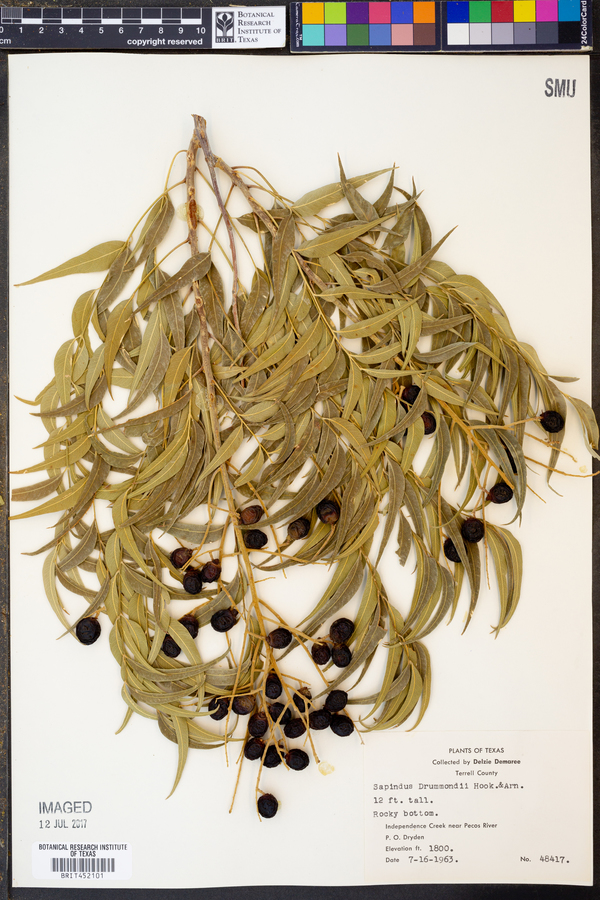
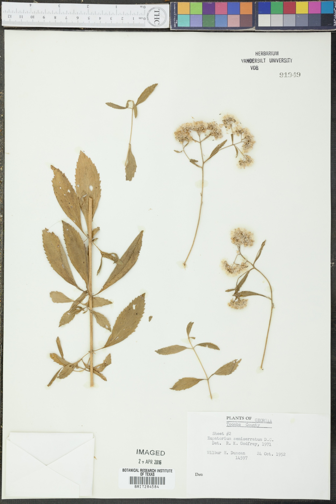

This experimental biodiversity datasets describes BRIT records and associated images. 


# Methods 

Preston v0.3.9 was used to randomly sample 1000 image urls published across three BRIT related to DwC-A records using:

```bash
# lists image urls after tracking dwca archives
preston track https://sernecportal.org/portal/content/dwca/VDB_DwC-A.zip\
 https://sernecportal.org/portal/content/dwca/NLU_DwC-A.zip\
 https://portal.torcherbaria.org/portal/content/dwca/BRIT_DwC-A.zip\
 | preston dwc-stream\
 | grep URI\
 | jq --raw-output '.["http://rs.tdwg.org/ac/terms/accessURI" | "http://rs.tdwg.org/ac/terms/thumbnailAccessURI" | "http://rs.tdwg.org/ac/terms/goodQualityAccessURI"]'\
 > image-urls.tsv

 # randomly sample 1000 expected image urls and track them
 shuf -n 1000 image-urls.tsv | xargs -L25 preston track
 ```

This sample of 1000 tracked expected image url was generated on a consumer grade fiber internet connection and started at:

```
preston ls | grep -o "2022-05-24T.*Z" | sort | uniq | head -n1
2022-05-24T13:22:05.497Z
```

and ended at:

```
preston ls | grep -o "2022-05-24T.*Z" | sort | uniq | tail -n1
2022-05-24T13:32:30.149Z
```

so took about 10 minutes.

# Results

An example of a tracked image shown below was extraced using:

```
$ preston ls -l tsv\
 | grep hasVersion\
 | grep -v "well-known"\
 | tail -n1
https://web.corral.tacc.utexas.edu/torch/BRIT/BRIT0452000/BRIT452101_med.jpg	http://purl.org/pav/hasVersion	hash://sha256/5807395372135bbc50350ebae598c9484cb279cc2d17b003a06626f03fb0853e	urn:uuid:6d46581e-8dfa-4c90-96d4-c06155b2b2ee
$ preston cat hash://sha256/5807395372135bbc50350ebae598c9484cb279cc2d17b003a06626f03fb0853e > BRIT452101_med.jpg
```



with caption generated using:

```
$ preston ls\
 | grep hasVersion\
 | grep zip\
 | preston dwc-stream\
 | grep BRIT452101\
 | jq .
```

```json 
{
  "http://www.w3.org/ns/prov#wasDerivedFrom": "line:zip:hash://sha256/28ebbca9c3e3d092e6193f5f54f476815f4e347ff79b1bb7de07090e78a648ea!/occurrences.csv!/L129118",
  "http://www.w3.org/1999/02/22-rdf-syntax-ns#type": "http://rs.tdwg.org/dwc/terms/Occurrence",
  "http://rs.tdwg.org/dwc/terms/coordinateUncertaintyInMeters": null,
  "http://rs.tdwg.org/dwc/terms/informationWithheld": null,
  "http://rs.tdwg.org/dwc/terms/minimumElevationInMeters": null,
  "http://rs.tdwg.org/dwc/terms/specificEpithet": "drummondii",
  "http://rs.tdwg.org/dwc/terms/individualCount": null,
  "http://rs.tdwg.org/dwc/terms/stateProvince": "Texas",
  "http://rs.tdwg.org/dwc/terms/family": "Sapindaceae",
  "http://rs.tdwg.org/dwc/terms/georeferenceSources": null,
  "http://rs.tdwg.org/dwc/terms/verbatimEventDate": null,
  "https://symbiota.org/terms/recordID": "urn:uuid:606c50c8-fccb-44a9-af1e-411766713fcf",
  "http://rs.tdwg.org/dwc/terms/dynamicProperties": null,
  "http://rs.tdwg.org/dwc/terms/locality": "Independence Creek near Pecos River. P. O. Dryden.",
  "http://rs.tdwg.org/dwc/terms/georeferencedBy": null,
  "http://rs.tdwg.org/dwc/terms/georeferenceRemarks": null,
  "http://rs.tdwg.org/dwc/terms/minimumDepthInMeters": null,
  "http://rs.tdwg.org/dwc/terms/decimalLongitude": null,
  "http://rs.tdwg.org/dwc/terms/typeStatus": null,
  "http://rs.tdwg.org/dwc/terms/year": "1963",
  "http://rs.tdwg.org/dwc/terms/endDayOfYear": null,
  "http://rs.tdwg.org/dwc/terms/maximumDepthInMeters": null,
  "http://rs.tdwg.org/dwc/terms/occurrenceRemarks": null,
  "http://rs.tdwg.org/dwc/terms/country": "United States",
  "http://rs.tdwg.org/dwc/terms/maximumElevationInMeters": null,
  "http://rs.tdwg.org/dwc/terms/occurrenceID": "606c50c8-fccb-44a9-af1e-411766713fcf",
  "https://symbiota.org/terms/recordEnteredBy": "preprocessed",
  "http://rs.tdwg.org/dwc/terms/ownerInstitutionCode": null,
  "http://purl.org/dc/terms/accessRights": null,
  "http://rs.tdwg.org/dwc/terms/collectionCode": null,
  "http://rs.tdwg.org/dwc/terms/recordedBy": "Delzie Demaree",
  "http://rs.tdwg.org/dwc/terms/lifeStage": null,
  "http://rs.tdwg.org/dwc/terms/day": "16",
  "http://rs.tdwg.org/dwc/terms/associatedSequences": null,
  "http://rs.tdwg.org/dwc/terms/verbatimDepth": null,
  "http://rs.tdwg.org/dwc/terms/identificationQualifier": null,
  "http://rs.tdwg.org/dwc/terms/order": "Sapindales",
  "http://rs.tdwg.org/dwc/terms/georeferenceVerificationStatus": null,
  "http://purl.org/dc/terms/references": "https://portal.torcherbaria.org/portal/collections/individual/index.php?occid=24923936",
  "http://rs.tdwg.org/dwc/terms/collectionID": "fea81a47-2365-45cc-bef9-b6bbff7457e6",
  "http://rs.tdwg.org/dwc/terms/geodeticDatum": null,
  "http://rs.tdwg.org/dwc/terms/reproductiveCondition": null,
  "http://rs.tdwg.org/dwc/terms/preparations": null,
  "http://rs.tdwg.org/dwc/terms/subgenus": null,
  "http://rs.tdwg.org/dwc/terms/county": "Terrell",
  "http://rs.tdwg.org/dwc/terms/kingdom": "Plantae",
  "http://rs.tdwg.org/dwc/terms/establishmentMeans": null,
  "http://purl.org/dc/terms/rightsHolder": "Botanical Research Institute of Texas",
  "http://rs.tdwg.org/dwc/terms/taxonRemarks": null,
  "http://rs.tdwg.org/dwc/terms/georeferenceProtocol": null,
  "http://rs.tdwg.org/dwc/terms/sex": null,
  "http://rs.tdwg.org/dwc/terms/otherCatalogNumbers": null,
  "http://rs.tdwg.org/dwc/terms/fieldNumber": null,
  "http://rs.tdwg.org/dwc/terms/identifiedBy": null,
  "http://rs.tdwg.org/dwc/terms/scientificName": "Sapindus drummondii",
  "http://rs.tdwg.org/dwc/terms/habitat": "Elevation ft. 1800. 12 ft. tall. Rocky bottom",
  "http://rs.tdwg.org/dwc/terms/associatedOccurrences": null,
  "http://rs.tdwg.org/dwc/terms/verbatimCoordinates": null,
  "http://rs.tdwg.org/dwc/terms/recordNumber": "48417",
  "http://purl.org/dc/terms/modified": "2020-09-25 10:38:07",
  "http://rs.tdwg.org/dwc/terms/class": null,
  "http://rs.tdwg.org/dwc/terms/verbatimTaxonRank": null,
  "http://rs.tdwg.org/dwc/terms/institutionCode": "BRIT",
  "http://rs.tdwg.org/dwc/terms/disposition": null,
  "http://rs.tdwg.org/dwc/terms/phylum": "Magnoliophyta",
  "http://rs.tdwg.org/dwc/terms/identificationRemarks": null,
  "http://rs.tdwg.org/dwc/terms/eventDate": "1963-07-16",
  "http://purl.org/dc/terms/language": null,
  "http://rs.tdwg.org/dwc/terms/month": "7",
  "http://rs.tdwg.org/dwc/terms/scientificNameAuthorship": "Hook. & Arn.",
  "http://rs.tdwg.org/dwc/terms/infraspecificEpithet": null,
  "http://rs.tdwg.org/dwc/terms/dateIdentified": null,
  "http://purl.org/dc/elements/1.1/rights": "http://creativecommons.org/licenses/by/4.0/",
  "http://rs.tdwg.org/dwc/terms/municipality": null,
  "http://rs.tdwg.org/dwc/terms/identificationReferences": null,
  "http://rs.tdwg.org/dwc/terms/genus": "Sapindus",
  "http://rs.tdwg.org/dwc/terms/basisOfRecord": "PreservedSpecimen",
  "http://rs.tdwg.org/dwc/terms/taxonID": "15950",
  "http://rs.tdwg.org/dwc/terms/locationRemarks": null,
  "http://rs.tdwg.org/dwc/terms/catalogNumber": "BRIT452101",
  "http://rs.tdwg.org/dwc/terms/verbatimElevation": null,
  "http://rs.tdwg.org/dwc/terms/higherClassification": "Plantae|Magnoliophyta|Eudicots|Core Eudicots|Malvids|Rosids|Sapindales|Sapindaceae|Sapindus",
  "http://rs.tdwg.org/dwc/terms/dataGeneralizations": null,
  "http://rs.tdwg.org/dwc/terms/eventID": null,
  "http://rs.tdwg.org/dwc/terms/taxonRank": "Species",
  "http://rs.tdwg.org/dwc/terms/startDayOfYear": "197",
  "http://rs.tdwg.org/dwc/terms/associatedTaxa": null,
  "http://rs.tdwg.org/dwc/terms/decimalLatitude": null
}
{
  "http://www.w3.org/ns/prov#wasDerivedFrom": "line:zip:hash://sha256/28ebbca9c3e3d092e6193f5f54f476815f4e347ff79b1bb7de07090e78a648ea!/multimedia.csv!/L102995",
  "http://www.w3.org/1999/02/22-rdf-syntax-ns#type": "http://rs.tdwg.org/ac/terms/Multimedia",
  "http://rs.tdwg.org/ac/terms/comments": null,
  "http://rs.tdwg.org/ac/terms/metadataLanguage": "en",
  "http://purl.org/dc/terms/identifier": "https://web.corral.tacc.utexas.edu/torch/BRIT/BRIT0452000/BRIT452101.jpg",
  "http://purl.org/dc/elements/1.1/creator": null,
  "http://ns.adobe.com/xap/1.0/MetadataDate": "2020-05-16 15:32:09",
  "http://purl.org/dc/terms/type": "StillImage",
  "http://purl.org/dc/terms/format": "image/jpeg",
  "http://rs.tdwg.org/ac/terms/caption": null,
  "http://ns.adobe.com/xap/1.0/rights/WebStatement": "http://creativecommons.org/licenses/by/4.0/",
  "http://rs.tdwg.org/ac/terms/thumbnailAccessURI": "https://web.corral.tacc.utexas.edu/torch/BRIT/BRIT0452000/BRIT452101_thumb.jpg",
  "http://rs.tdwg.org/ac/terms/subtype": "Photograph",
  "http://rs.tdwg.org/ac/terms/accessURI": "https://web.corral.tacc.utexas.edu/torch/BRIT/BRIT0452000/BRIT452101.jpg",
  "http://purl.org/dc/terms/rights": null,
  "http://ns.adobe.com/xap/1.0/rights/UsageTerms": "CC BY-NC-SA (Attribution-NonCommercial-ShareAlike)",
  "http://rs.tdwg.org/ac/terms/goodQualityAccessURI": "https://web.corral.tacc.utexas.edu/torch/BRIT/BRIT0452000/BRIT452101_med.jpg",
  "http://ns.adobe.com/xap/1.0/rights/Owner": "Botanical Research Institute of Texas",
  "http://rs.tdwg.org/ac/terms/providerManagedID": "urn:uuid:da7f9fe0-225d-409f-8243-10ca07bb3505",
  "http://rs.tdwg.org/ac/terms/associatedSpecimenReference": "https://portal.torcherbaria.org/portal/collections/individual/index.php?occid=24923936"
}
```


The sampled BRIT image corpus has the following provenance:

```
$ preston history
<urn:uuid:0659a54f-b713-4f86-a917-5be166a14110> <http://purl.org/pav/hasVersion> <hash://sha256/b2496653614e40b2b15fee5d98abeed361707f7ae27cc08e07de9bceb821fb1b> .
<hash://sha256/10ac478098a79401932a7158a61df93da013d374b714a40c2b4d299f421c8610> <http://purl.org/pav/previousVersion> <hash://sha256/b2496653614e40b2b15fee5d98abeed361707f7ae27cc08e07de9bceb821fb1b> .
<hash://sha256/02e62f5f3af5652d71da3662b50b90a9ae0f8c01d3e3e41df37097f365584325> <http://purl.org/pav/previousVersion> <hash://sha256/10ac478098a79401932a7158a61df93da013d374b714a40c2b4d299f421c8610> .
<hash://sha256/e9271886e84b5577adc0ab6873e4be48497c81034398df1a7945fd6697e0d0f1> <http://purl.org/pav/previousVersion> <hash://sha256/02e62f5f3af5652d71da3662b50b90a9ae0f8c01d3e3e41df37097f365584325> .
<hash://sha256/f6c9113acbf8eb07d4a4f95764ae071b764a4b24cb733d750fdcdaaa66989e52> <http://purl.org/pav/previousVersion> <hash://sha256/e9271886e84b5577adc0ab6873e4be48497c81034398df1a7945fd6697e0d0f1> .
<hash://sha256/76af1da00538d051968242ffa9f817470059777f7c4fe49a1979ad26eac46eff> <http://purl.org/pav/previousVersion> <hash://sha256/f6c9113acbf8eb07d4a4f95764ae071b764a4b24cb733d750fdcdaaa66989e52> .
<hash://sha256/09bc3dfeb7f003a2706c519d0566ca12f3c4b78ecf28203228d6c179f9793d0a> <http://purl.org/pav/previousVersion> <hash://sha256/76af1da00538d051968242ffa9f817470059777f7c4fe49a1979ad26eac46eff> .
<hash://sha256/e20f505608884a4db018e1120f38b1c25d78a63662b9131658e5bdd49ab04b27> <http://purl.org/pav/previousVersion> <hash://sha256/09bc3dfeb7f003a2706c519d0566ca12f3c4b78ecf28203228d6c179f9793d0a> .
<hash://sha256/90fda0bcf48a2619777ba065bfdd4b1d34a5ef1c7053a12e73498a57f2fd5be9> <http://purl.org/pav/previousVersion> <hash://sha256/e20f505608884a4db018e1120f38b1c25d78a63662b9131658e5bdd49ab04b27> .
<hash://sha256/694a0224f1561972625eaed0238c4433e08be3ae065bf7d3c31d4d02b19be458> <http://purl.org/pav/previousVersion> <hash://sha256/90fda0bcf48a2619777ba065bfdd4b1d34a5ef1c7053a12e73498a57f2fd5be9> .
<hash://sha256/5cab61d4a546c4801fc80326644121e39e63623fac7283566c09ef62f4b876c4> <http://purl.org/pav/previousVersion> <hash://sha256/694a0224f1561972625eaed0238c4433e08be3ae065bf7d3c31d4d02b19be458> .
<hash://sha256/1ec9213d122c5869b04e58d6a8c3dd1ba81b6d447d51f1e2d9fd4b5ad6d03da7> <http://purl.org/pav/previousVersion> <hash://sha256/5cab61d4a546c4801fc80326644121e39e63623fac7283566c09ef62f4b876c4> .
<hash://sha256/0eac29a01fd22de922acb4a84ea0d741677926cb76ded3754c080053c0c2cf20> <http://purl.org/pav/previousVersion> <hash://sha256/1ec9213d122c5869b04e58d6a8c3dd1ba81b6d447d51f1e2d9fd4b5ad6d03da7> .
<hash://sha256/78ac664148ab45ca7f7794d22b92e95c1fa8cbda531cdb98df9378b163566d74> <http://purl.org/pav/previousVersion> <hash://sha256/0eac29a01fd22de922acb4a84ea0d741677926cb76ded3754c080053c0c2cf20> .
<hash://sha256/92303aebc2664d28098cc651d515d4a7dc6ff62af10ebe7b1e042354a3ca2717> <http://purl.org/pav/previousVersion> <hash://sha256/78ac664148ab45ca7f7794d22b92e95c1fa8cbda531cdb98df9378b163566d74> .
<hash://sha256/9c15fa988428155a6a557d3b6f19e6eafabc95ade2b427a905fede9e02f67a81> <http://purl.org/pav/previousVersion> <hash://sha256/92303aebc2664d28098cc651d515d4a7dc6ff62af10ebe7b1e042354a3ca2717> .
<hash://sha256/ffb287253cc786e23766226df2e81dd8ac73f532fd708a0a661976f370adc157> <http://purl.org/pav/previousVersion> <hash://sha256/9c15fa988428155a6a557d3b6f19e6eafabc95ade2b427a905fede9e02f67a81> .
<hash://sha256/166089eb3e836c549f0bbcc458983165d975db3713ce217d174566f20ba90fd4> <http://purl.org/pav/previousVersion> <hash://sha256/ffb287253cc786e23766226df2e81dd8ac73f532fd708a0a661976f370adc157> .
<hash://sha256/444d71f6c77ede348c580abf3e368dfa50f19755e384f1a5c9da0ece8b91d0ff> <http://purl.org/pav/previousVersion> <hash://sha256/166089eb3e836c549f0bbcc458983165d975db3713ce217d174566f20ba90fd4> .
<hash://sha256/cbf6a6bf53a4a68ec36a7d0a655e9b7fb278fa81e193334649ac8debede2bfc5> <http://purl.org/pav/previousVersion> <hash://sha256/444d71f6c77ede348c580abf3e368dfa50f19755e384f1a5c9da0ece8b91d0ff> .
<hash://sha256/43d0b7c5381e5990d853550a5239df77c502bf9bb751bb8df35941ab9e1e6f98> <http://purl.org/pav/previousVersion> <hash://sha256/cbf6a6bf53a4a68ec36a7d0a655e9b7fb278fa81e193334649ac8debede2bfc5> .
<hash://sha256/898216fa9a7c3ee42c0d3901328ed37db3376b79a82364bd9c537cebefa7cd5a> <http://purl.org/pav/previousVersion> <hash://sha256/43d0b7c5381e5990d853550a5239df77c502bf9bb751bb8df35941ab9e1e6f98> .
<hash://sha256/2e0e34bd0aa57da9f9e812c0278bb7c0fb11c3b6f0250138b127c2b7d03c2256> <http://purl.org/pav/previousVersion> <hash://sha256/898216fa9a7c3ee42c0d3901328ed37db3376b79a82364bd9c537cebefa7cd5a> .
<hash://sha256/e39befc0e59f55af88b84079920b3cd99703af57b3ba4f900129fd8a8ce06853> <http://purl.org/pav/previousVersion> <hash://sha256/2e0e34bd0aa57da9f9e812c0278bb7c0fb11c3b6f0250138b127c2b7d03c2256> .
<hash://sha256/257080d801da080a60e403d8f8dfbcc0e74947059b0f2768b1148502e3609464> <http://purl.org/pav/previousVersion> <hash://sha256/e39befc0e59f55af88b84079920b3cd99703af57b3ba4f900129fd8a8ce06853> .
<hash://sha256/28f049188887238ef115c0d540d0ed869671bf40b54f60a0c7ffc9733ee218ce> <http://purl.org/pav/previousVersion> <hash://sha256/257080d801da080a60e403d8f8dfbcc0e74947059b0f2768b1148502e3609464> .
<hash://sha256/e71f050754b1e93cf357d30d8dbe4afedfd9c5944d1e35320e7486cc042e89af> <http://purl.org/pav/previousVersion> <hash://sha256/28f049188887238ef115c0d540d0ed869671bf40b54f60a0c7ffc9733ee218ce> .
<hash://sha256/5e7b0a94243363061b29735d0689b4f07078c8e9d1fb3699d80a9317676325e9> <http://purl.org/pav/previousVersion> <hash://sha256/e71f050754b1e93cf357d30d8dbe4afedfd9c5944d1e35320e7486cc042e89af> .
<hash://sha256/4307756db0f0aa2853c5fc41791d4018a5ad66d2b8692f3b71cd2ff2eb7d0ba4> <http://purl.org/pav/previousVersion> <hash://sha256/5e7b0a94243363061b29735d0689b4f07078c8e9d1fb3699d80a9317676325e9> .
<hash://sha256/049f44a6bbed9d0c1611098034853bce80b192cb96a4bb5c93a3d8aab22a03e0> <http://purl.org/pav/previousVersion> <hash://sha256/4307756db0f0aa2853c5fc41791d4018a5ad66d2b8692f3b71cd2ff2eb7d0ba4> .
<hash://sha256/9257182157b77a6c2e5dab334118f328eb8118f0f82e5e1d2ce471fe99e542a8> <http://purl.org/pav/previousVersion> <hash://sha256/049f44a6bbed9d0c1611098034853bce80b192cb96a4bb5c93a3d8aab22a03e0> .
<hash://sha256/0b17f252bf52ad7bfdc4bc4d5d8f7d4517a80f384ab42e3706799ed62e9ba0fe> <http://purl.org/pav/previousVersion> <hash://sha256/9257182157b77a6c2e5dab334118f328eb8118f0f82e5e1d2ce471fe99e542a8> .
<hash://sha256/578dc066040fa3e6ad8c92f7eeedb0cb29358b051a608cbb40edaec5204357f9> <http://purl.org/pav/previousVersion> <hash://sha256/0b17f252bf52ad7bfdc4bc4d5d8f7d4517a80f384ab42e3706799ed62e9ba0fe> .
<hash://sha256/083f1ccf7c1f6af7a86eb5f97ebe50d9b0a94a659a9f422d8d99569b6e17351b> <http://purl.org/pav/previousVersion> <hash://sha256/578dc066040fa3e6ad8c92f7eeedb0cb29358b051a608cbb40edaec5204357f9> .
<hash://sha256/106dfd76da75295b1563a44dae2c52b1f354ea526f734ca66d711a76c6a3dc52> <http://purl.org/pav/previousVersion> <hash://sha256/083f1ccf7c1f6af7a86eb5f97ebe50d9b0a94a659a9f422d8d99569b6e17351b> .
<hash://sha256/91e3e78b72abb4b4d1e205942a68129f926d06e69cc0514a908e3f7378547d90> <http://purl.org/pav/previousVersion> <hash://sha256/106dfd76da75295b1563a44dae2c52b1f354ea526f734ca66d711a76c6a3dc52> .
<hash://sha256/6551b5e735e8492da1b132c4a396899d35c187edb5ef3f32c9d8c64f8078d40e> <http://purl.org/pav/previousVersion> <hash://sha256/91e3e78b72abb4b4d1e205942a68129f926d06e69cc0514a908e3f7378547d90> .
<hash://sha256/7299c0090fd2eac66be38f889dd9bb3e62e1618c76122f5df08cee4844bfa6e3> <http://purl.org/pav/previousVersion> <hash://sha256/6551b5e735e8492da1b132c4a396899d35c187edb5ef3f32c9d8c64f8078d40e> .
<hash://sha256/abeb528c0496d0e447814ee98b42230f9a7469e1ef0d8f047492d4383ae8a1fb> <http://purl.org/pav/previousVersion> <hash://sha256/7299c0090fd2eac66be38f889dd9bb3e62e1618c76122f5df08cee4844bfa6e3> .
<hash://sha256/bf4bdfdc3b8c5fd38c9658251ce1954c5a73f0e67a8548534e89864fbc356367> <http://purl.org/pav/previousVersion> <hash://sha256/abeb528c0496d0e447814ee98b42230f9a7469e1ef0d8f047492d4383ae8a1fb> .
<hash://sha256/2697fd6a171c8baa3b2d922587e8d5595cab38c5618e354e94cce94daeeeb1f8> <http://purl.org/pav/previousVersion> <hash://sha256/bf4bdfdc3b8c5fd38c9658251ce1954c5a73f0e67a8548534e89864fbc356367> .
<hash://sha256/9ddb00e97a548907bb633cb1f0a20fd38a70959c82b0afd328c46090303e1b65> <http://purl.org/pav/previousVersion> <hash://sha256/2697fd6a171c8baa3b2d922587e8d5595cab38c5618e354e94cce94daeeeb1f8> .
```

More concisely, this sampled BRIT image corpus can be reference using a citation signature hash://sha256/9ddb00e97a548907bb633cb1f0a20fd38a70959c82b0afd328c46090303e1b65 . 

For this corpus, the following servers were queried for reported image urls:

```
$ preston ls -l tsv  | grep hasVersion | sed 's+https://++g' | cut -f1 | sed 's+/.*++g' | sort | uniq -c | sort -nr
    735 bisque.cyverse.org
    254 web.corral.tacc.utexas.edu
     10 api.idigbio.org
      2 sernecportal.org
      2 portal.torcherbaria.org
```

Preston reports non-responsive URLs as skolemized blanks see https://www.w3.org/TR/rdf11-concepts/#section-skolemization .

Using this labeling of non-responsible image URLs, the following servers produced non-responsive urls:

```
$ preston ls -l tsv\
 | grep hasVersion\
 | grep ".well-known/genid"\
 | sed 's+https://++g'\
 | cut -f1\
 | sed 's+/.*++g'\
 | sort\
 | uniq -c\
 | sort -nr
    735 bisque.cyverse.org
```

suggesting that most, if not all, image URLs served via bisque.cyverse.org are not responding to reported DwC-A image URLs.

Responsive image URLs from the 1000 randomly sampled set come from the following servers:

```
$ preston ls -l tsv\
 | grep hasVersion\
 | grep -v ".well-known/genid"\
 | sed 's+https://++g'\
 | cut -f1\
 | sed 's+/.*++g'\
 | sort\
 | uniq -c\
 | sort -nr
    254 web.corral.tacc.utexas.edu
     10 api.idigbio.org
      2 sernecportal.org
      2 portal.torcherbaria.org
```

# Result Revisited

After asking about the accessbility BisQue image locations at CyVerse, it appears that the server suffered from some intermittent downtime. 

After re-tracking the image locations with previous unresolved content using:

```
$ preston ls -l tsv\
 | grep hasVersion\
 | grep well-known\
 | cut -f1\
 | xargs -L25 preston track
```

following this, 
```
$ preston ls -l tsv\
>  | grep hasVersion\
>  | grep -v ".well-known/genid"\
>  | sed 's+https://++g'\
>  | cut -f1\
>  | sed 's+/.*++g'\
>  | sort\
>  | uniq -c\
>  | sort -nr
    735 bisque.cyverse.org
    254 web.corral.tacc.utexas.edu
     10 api.idigbio.org
      2 sernecportal.org
      2 portal.torcherbaria.org
```

was seen, which suggests that all 735 BisQue served images now have content associated to them.

The first image re-resolve using BisQue service at CyVerse was the one below.


```
$ preston ls -l tsv\
  | grep hasVersion\
  | grep -v well-known\
  | grep bisque\
  | head -n1
https://bisque.cyverse.org/image_service/image/00-ieZahoKgtcwyaSAEuRLeL7/resize:1250/format:jpeg	http://purl.org/pav/hasVersion	hash://sha256/21f71ab31e8a559e1125dea3f1bff89ed193fc9d40878fced6d4cc92b153c71e	urn:uuid:7ca87d5a-f92e-43df-90c9-6cb509aa95eb
$ preston cat hash://sha256/21f71ab31e8a559e1125dea3f1bff89ed193fc9d40878fced6d4cc92b153c71e > 21f71ab31e8a559e1125dea3f1bff89ed193fc9d40878fced6d4cc92b153c71e.jpg
```

with the related image being:




```
$ preston ls\
 | preston dwc-stream\
 | grep "https://sernecportal.org/portal/collections/individual/index.php?occid=16667540"\
 | jq .
```

```json
{
  "http://www.w3.org/ns/prov#wasDerivedFrom": "line:zip:hash://sha256/371984ca4566b7b6bc760d0766873b469e12af2d87ce9218f1da888a1b4c3948!/occurrences.csv!/L38393",
  "http://www.w3.org/1999/02/22-rdf-syntax-ns#type": "http://rs.tdwg.org/dwc/terms/Occurrence",
  "http://rs.tdwg.org/dwc/terms/occurrenceRemarks": null,
  "http://rs.tdwg.org/dwc/terms/subgenus": null,
  "http://rs.tdwg.org/dwc/terms/associatedOccurrences": null,
  "http://rs.tdwg.org/dwc/terms/coordinateUncertaintyInMeters": null,
  "http://rs.tdwg.org/dwc/terms/identificationQualifier": null,
  "http://rs.tdwg.org/dwc/terms/recordNumber": null,
  "http://rs.tdwg.org/dwc/terms/georeferenceProtocol": null,
  "http://rs.tdwg.org/dwc/terms/informationWithheld": null,
  "http://rs.tdwg.org/dwc/terms/family": "Asteraceae",
  "http://rs.tdwg.org/dwc/terms/verbatimElevation": null,
  "https://symbiota.org/terms/recordID": "urn:uuid:2a5c093b-3cd5-4334-b3ab-ff60bd3012bd",
  "http://rs.tdwg.org/dwc/terms/verbatimTaxonRank": null,
  "http://purl.org/dc/terms/references": "https://sernecportal.org/portal/collections/individual/index.php?occid=16667540",
  "http://rs.tdwg.org/dwc/terms/month": null,
  "http://rs.tdwg.org/dwc/terms/fieldNumber": null,
  "http://rs.tdwg.org/dwc/terms/dynamicProperties": null,
  "http://rs.tdwg.org/dwc/terms/associatedTaxa": null,
  "http://rs.tdwg.org/dwc/terms/endDayOfYear": null,
  "http://rs.tdwg.org/dwc/terms/basisOfRecord": "PreservedSpecimen",
  "http://rs.tdwg.org/dwc/terms/higherClassification": "Plantae|Magnoliophyta|Eudicots|Core Eudicots|Campanulids|Asterids|Asterales|Asteraceae|Eupatorium",
  "http://rs.tdwg.org/dwc/terms/order": "Asterales",
  "http://rs.tdwg.org/dwc/terms/reproductiveCondition": null,
  "http://rs.tdwg.org/dwc/terms/georeferenceRemarks": null,
  "http://rs.tdwg.org/dwc/terms/minimumDepthInMeters": null,
  "http://rs.tdwg.org/dwc/terms/scientificName": "Eupatorium semiserratum",
  "http://rs.tdwg.org/dwc/terms/recordedBy": null,
  "http://rs.tdwg.org/dwc/terms/associatedSequences": null,
  "https://symbiota.org/terms/recordEnteredBy": "preprocessed",
  "http://rs.tdwg.org/dwc/terms/county": null,
  "http://rs.tdwg.org/dwc/terms/georeferencedBy": null,
  "http://purl.org/dc/elements/1.1/rights": "http://creativecommons.org/licenses/by-nc/3.0/",
  "http://rs.tdwg.org/dwc/terms/occurrenceID": "2a5c093b-3cd5-4334-b3ab-ff60bd3012bd",
  "http://rs.tdwg.org/dwc/terms/identificationRemarks": "identified as filed, taxon from folder transcription",
  "http://rs.tdwg.org/dwc/terms/phylum": "Magnoliophyta",
  "http://rs.tdwg.org/dwc/terms/taxonRank": "Species",
  "http://rs.tdwg.org/dwc/terms/establishmentMeans": null,
  "http://rs.tdwg.org/dwc/terms/collectionID": "9bec1885-8556-470e-80f3-f31ed15228b0",
  "http://purl.org/dc/terms/modified": "2021-05-24 11:31:38",
  "http://rs.tdwg.org/dwc/terms/maximumElevationInMeters": null,
  "http://rs.tdwg.org/dwc/terms/dataGeneralizations": null,
  "http://rs.tdwg.org/dwc/terms/municipality": null,
  "http://rs.tdwg.org/dwc/terms/locationRemarks": null,
  "http://purl.org/dc/terms/language": null,
  "http://purl.org/dc/terms/rightsHolder": null,
  "http://rs.tdwg.org/dwc/terms/verbatimEventDate": null,
  "http://rs.tdwg.org/dwc/terms/dateIdentified": "12/27/18",
  "http://rs.tdwg.org/dwc/terms/typeStatus": null,
  "http://rs.tdwg.org/dwc/terms/minimumElevationInMeters": null,
  "http://rs.tdwg.org/dwc/terms/disposition": null,
  "http://rs.tdwg.org/dwc/terms/eventDate": null,
  "http://rs.tdwg.org/dwc/terms/identificationReferences": null,
  "http://rs.tdwg.org/dwc/terms/stateProvince": null,
  "http://rs.tdwg.org/dwc/terms/ownerInstitutionCode": null,
  "http://rs.tdwg.org/dwc/terms/eventID": null,
  "http://rs.tdwg.org/dwc/terms/taxonRemarks": null,
  "http://rs.tdwg.org/dwc/terms/scientificNameAuthorship": "DC.",
  "http://rs.tdwg.org/dwc/terms/locality": null,
  "http://rs.tdwg.org/dwc/terms/decimalLatitude": null,
  "http://rs.tdwg.org/dwc/terms/verbatimCoordinates": null,
  "http://rs.tdwg.org/dwc/terms/taxonID": "84133",
  "http://rs.tdwg.org/dwc/terms/infraspecificEpithet": null,
  "http://rs.tdwg.org/dwc/terms/habitat": null,
  "http://rs.tdwg.org/dwc/terms/catalogNumber": "BRIT284584",
  "http://rs.tdwg.org/dwc/terms/preparations": null,
  "http://rs.tdwg.org/dwc/terms/sex": null,
  "http://rs.tdwg.org/dwc/terms/georeferenceSources": null,
  "http://rs.tdwg.org/dwc/terms/verbatimDepth": null,
  "http://rs.tdwg.org/dwc/terms/collectionCode": null,
  "http://rs.tdwg.org/dwc/terms/otherCatalogNumbers": null,
  "http://rs.tdwg.org/dwc/terms/individualCount": null,
  "http://purl.org/dc/terms/accessRights": null,
  "http://rs.tdwg.org/dwc/terms/kingdom": "Plantae",
  "http://rs.tdwg.org/dwc/terms/country": "United States",
  "http://rs.tdwg.org/dwc/terms/year": null,
  "http://rs.tdwg.org/dwc/terms/institutionCode": "VDB",
  "http://rs.tdwg.org/dwc/terms/day": null,
  "http://rs.tdwg.org/dwc/terms/lifeStage": null,
  "http://rs.tdwg.org/dwc/terms/maximumDepthInMeters": null,
  "http://rs.tdwg.org/dwc/terms/decimalLongitude": null,
  "http://rs.tdwg.org/dwc/terms/specificEpithet": "semiserratum",
  "http://rs.tdwg.org/dwc/terms/genus": "Eupatorium",
  "http://rs.tdwg.org/dwc/terms/class": null,
  "http://rs.tdwg.org/dwc/terms/geodeticDatum": null,
  "http://rs.tdwg.org/dwc/terms/georeferenceVerificationStatus": null,
  "http://rs.tdwg.org/dwc/terms/identifiedBy": "BRIT",
  "http://rs.tdwg.org/dwc/terms/startDayOfYear": null
}
{
  "http://www.w3.org/ns/prov#wasDerivedFrom": "line:zip:hash://sha256/371984ca4566b7b6bc760d0766873b469e12af2d87ce9218f1da888a1b4c3948!/multimedia.csv!/L38045",
  "http://www.w3.org/1999/02/22-rdf-syntax-ns#type": "http://rs.tdwg.org/ac/terms/Multimedia",
  "http://rs.tdwg.org/ac/terms/providerManagedID": "urn:uuid:6ecdb0c3-fa7e-4918-ba14-e10cd019b091",
  "http://purl.org/dc/terms/identifier": "https://bisque.cyverse.org/image_service/image/00-ieZahoKgtcwyaSAEuRLeL7/resize:4000/format:jpeg",
  "http://rs.tdwg.org/ac/terms/accessURI": "https://bisque.cyverse.org/image_service/image/00-ieZahoKgtcwyaSAEuRLeL7/resize:4000/format:jpeg",
  "http://ns.adobe.com/xap/1.0/rights/Owner": "Vanderbilt University Herbarium (VDB)",
  "http://purl.org/dc/elements/1.1/creator": null,
  "http://purl.org/dc/terms/type": "StillImage",
  "http://purl.org/dc/terms/rights": null,
  "http://ns.adobe.com/xap/1.0/rights/UsageTerms": "CC BY-NC (Attribution-Non-Commercial)",
  "http://rs.tdwg.org/ac/terms/subtype": "Photograph",
  "http://purl.org/dc/terms/format": "image/jpeg",
  "http://rs.tdwg.org/ac/terms/metadataLanguage": "en",
  "http://rs.tdwg.org/ac/terms/caption": null,
  "http://rs.tdwg.org/ac/terms/thumbnailAccessURI": "https://bisque.cyverse.org/image_service/image/00-ieZahoKgtcwyaSAEuRLeL7/thumbnail:200,200",
  "http://ns.adobe.com/xap/1.0/rights/WebStatement": "http://creativecommons.org/licenses/by-nc/3.0/",
  "http://rs.tdwg.org/ac/terms/associatedSpecimenReference": "https://sernecportal.org/portal/collections/individual/index.php?occid=16667540",
  "http://rs.tdwg.org/ac/terms/comments": null,
  "http://rs.tdwg.org/ac/terms/goodQualityAccessURI": "https://bisque.cyverse.org/image_service/image/00-ieZahoKgtcwyaSAEuRLeL7/resize:1250/format:jpeg",
  "http://ns.adobe.com/xap/1.0/MetadataDate": "2017-11-03 10:08:32"
}
```


